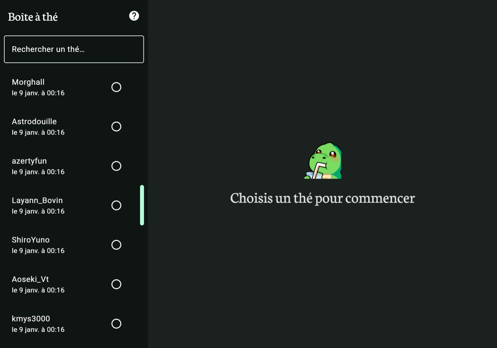

# La Théière

Ce projet consiste en un site web permettant de regrouper des anecdotes partagées sur un tchat
Twitch.


# Comment l'utiliser

En l'état, le projet est hardcodée pour pointer vers le tchat
d'[AngleDroit](https://twitch.tv/angledroit).

Il suffit de [naviguer sur le site](https://outadoc.github.io/teabot/), qui va se connecter de façon
transparente au tchat Twitch et commence à recenser les messages commençant par `!thé`.
Ceux-ci seront enregistrés en local dans le navigateur et organisés dans une interface adaptée.



### Build and Run Web Application

To build and run the development version of the web app, use the run configuration from the run
widget
in your IDE's toolbar or run it directly from the terminal:

- for the Wasm target (faster, modern browsers):
    - on macOS/Linux
      ```shell
      ./gradlew :composeApp:wasmJsBrowserDevelopmentRun
      ```
    - on Windows
      ```shell
      .\gradlew.bat :composeApp:wasmJsBrowserDevelopmentRun
      ```
- for the JS target (slower, supports older browsers):
    - on macOS/Linux
      ```shell
      ./gradlew :composeApp:jsBrowserDevelopmentRun
      ```
    - on Windows
      ```shell
      .\gradlew.bat :composeApp:jsBrowserDevelopmentRun
      ```
